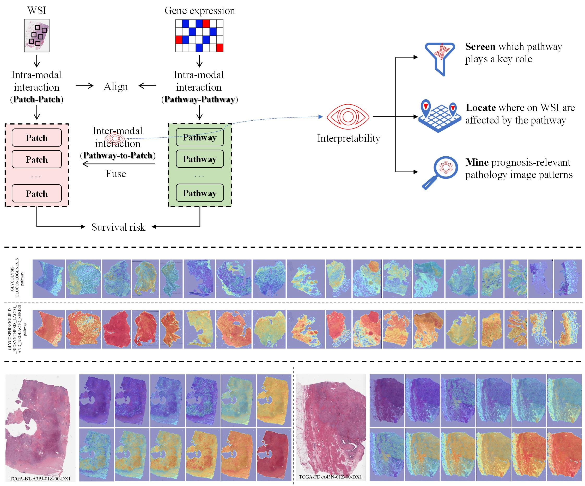

## PAMT: Pathway-Aware Multimodal Transformer

 

- - -
### Dataset
* whole slide image (WSI) and gene expression dataset: The WSIs and paired gene expression data used in this work are from TCGA (https://portal.gdc.cancer.gov/), open access to all.
* Biological pathway dataset: A total of curated 186 pathways from Kyoto Encyclopedia of Genes and Genomes (KEGG) pathway databases are used for survival analysis. The data download link is: https://www.gseamsigdb.org/gsea/msigdb/human/genesets.jsp?collection=CP:KEGG.
* Pathway-based gene expression matrix construction: `pathways_genes_matrix.csv`, `normalized_gene_expression_matrix_***.csv`, `COX_KM_ROC_curve.R`
- - -
### Data preprocessing: `wsi_data_process`

- `tissue_mask_svs.py`: This code is used to extract the tissue area from WSI and generate a tissue mask. The tissue mask identifies the tissue areas and excludes non-tissue areas.
- `genPatch_multi.py`: This code generates a patches dataset based on the tissue mask obtained from `tissue_mask_svs.py`. 
- `convertLevel.py`: This code extracts the low-level image of the WSI. 

### DINO model training: `dino`

- `main_dino.py`: This code trains a vision transformer (ViT) encoder model using the DINO (Self-Supervised Vision Transformers with DINO) framework. The DINO framework enables self-supervised learning for ViT models.
- `list_visualize_attention.py`: This code visualizes the self-attention of the [CLS] token on different heads of the last layer in the trained DINO model. It provides insights into how the model attends to different features during the self-supervised training.
- `get_features.py`: This code extracts a 384-dimensional feature vector for each patch using the trained DINO model. These features are used in subsequent clustering and predictive analyses.
For more details, see original code: https://github.com/facebookresearch/dino

### Clustering and patch selection: `patch_clustering`

- `featureClustering_dino.py`: This code performs clustering on the features extracted from the DINO model. It groups similar patches together based on their feature representations.
- `slide_select_byCluster.py`: This code randomly selects patches from the clustering results to build the PAMT training set and validation set. PAMT is a model we proposed used for survival predicting.
- `write_feat_txt_dino.py`: This code writes the extracted features from the clustering results into a text file for further processing.

### PAMT model training: `gene_wsi_predict`

- `train.py`:  This code performs the training of the PAMT model. The input of PAMT includes 2 parts: each patient's paired gene expression and a pathological image.
- `test.py`: This code performs the testing of the PAMT model.
- `utils_cox.py`: This code calculates the CIndex value, the negative partial log likelihood loss, etc.

### Visualization and analysis: `interpretability`

- `wsi_attn_visualization.py`: This code visualizes the multi-head attention of the PAMT model on the WSIs using the extracted cross-attention weights. The cross-attention weights provide information about the importance of different patches in the process of survival predicting.
- `combine_head_vis.py`: This code extracts the attention from the head with the highest weight in a multi-head attention mechanism and visualizes it.
- `smooth_heatmap.py`: This code applies a smoothing operation to the cross-attention heatmap, enhancing the visualization of the attention patterns.
- `combine_level_prob.py`: This code combines the attention heatmaps with the 20x magnified images of the WSIs to generate a combined visualization.
- The state-of-the-art nuclei instance segmentation method HoVer-Net was used to segment epithelial cells, the source codes and model weights are from: https://github.com/vqdang/hover_net

- - - 
### Environments

* Python==3.8.3
* Ubuntu==18.04.5
* torch==1.7.0
* torchvision==0.8.1
* timm==0.6.12 
* opencv-python==4.3.0
* opencv-python-headless==4.5.3
* openslide-python==1.1.2
* astropy==3.0.2
* numpy==1.23.0

* pandas==1.5.2
* Pillow==9.4.0
* scikit_image==0.17.2
* scikit_learn==1.2.1
* scipy==1.10.1
* skimage==0.0
* lifelines==0.27.7

- - -
If you have any questions, please contact Rui Yan at yanrui666666@gmail.com.

